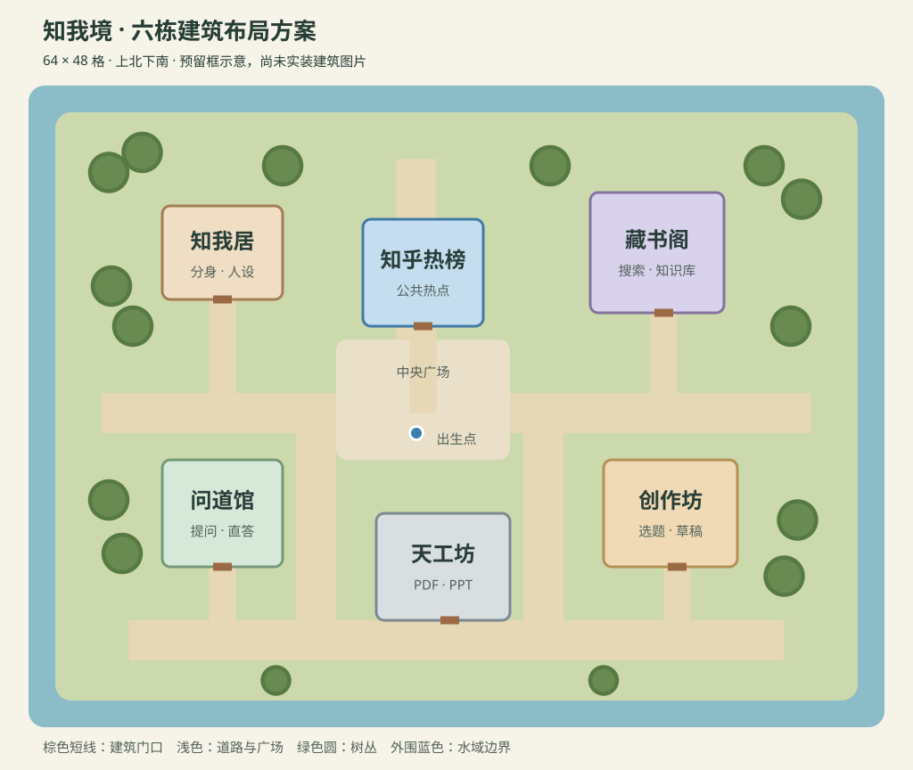

# 小镇布局方案

状态：六栋建筑、道路、碰撞、门口交互点和功能列表均已接入运行地图。

当前运行地图为 64×48 格，每格 32px（2048×1536px）；四张旧自然分区仅保留为素材来源，不是当前运行世界。布局保留紧凑尺度，优先让玩家在中央区域遇到其他分身。

## 建筑分区

坐标从左上角 (0,0) 开始。下表是图片预留框，不是整块碰撞区；最终尺寸应按图片有效内容和门的位置微调。

| 建筑 | 图片 | 预留框（左上角；宽×高，单位格） | 门前目标点 | 用途 |
| --- | --- | --- | --- | --- |
| 知我居 | zhihuhome.png | (10,9)；9×7 | (14,17) | 西北安静住宅，个人分身与人设 |
| 知乎热榜 | zhihuhot.png | (25,10)；9×8 | (29,19) | 广场北侧主地标，公共热点 |
| 藏书阁 | zhihubook.png | (42,8)；10×9 | (47,18) | 东北知识区，搜索与知识库 |
| 问道馆 | zhihuwendao.png | (10,28)；9×8 | (14,36) | 西南庭院，直答与提问 |
| 创作坊 | zhihuwrite.png | (43,28)；10×8 | (46,36) | 东南创作区，选题和草稿 |
| 天工坊 | zhihutiangong.png | (26,32)；10×8 | (31,40) | 南侧工坊，PDF 与 PPT |

## 道路与景观

- 中央广场保留在 (23,19)–(35,27)，出生点保留 (29,26)。热榜位于北侧，视线和出入口朝向广场。
- 东西主街位于 y=23–25；南侧环路位于 y=40–42，两侧连接路预留在 x=20–22 与 x=37–39，形成可绕行的步行环线。
- 建筑入口统一接南侧通路。问道馆和创作坊的门前支路向南接环路，避免把正面朝南的图片当成朝北入口使用。
- 门前留至少 2 格空地，主路宽 3 格，支路宽 2 格；碰撞边界按建筑底座单独定义，不能把整张图片的矩形当成墙。
- 树林集中在外围与西北住宅边缘，建筑间用 2–3 棵一组的树丛填充。广场中央、门口、转弯口保持开阔。
- 六栋建筑共享同一功能面板框架；长椅、灯笼、花坛和摊位可后补。

## 树显示异常与修复

旧脚本用 GID 17–20 随机放一个瓦片，实际取到树的下半部分。当前使用基础图集中的完整绿色圆树：上排 GID 9、10，下排 GID 17、18（图集每行 8 格）。树冠沿用图集 z=1、不碰撞的设置，树干沿用底部局部碰撞。摆放时检查整个 2×2 范围，禁止覆盖道路、水面、建筑或其他树。

## 后续能力接入顺序

1. 完成知乎 OAuth 后开放知我居个人数据与创作坊统计能力。
2. 补齐问题回答、内容详情、评论和单篇创作统计。
3. 接入藏书阁知识库能力。
4. 最后实现天工坊 PDF/PPT 异步任务、轮询和下载。

## 本次验证

- 地图测试通过：完整树木拼接、树冠/树干属性、道路和建筑不被树覆盖。
- `npm run build` 通过；后端 65 项测试通过。
- Playwright 浏览器检查通过：加载地图、方向键移动、手动接管、390px 窄屏显示。截图：[桌面全图](./town-trees-desktop.png)、[窄屏](./town-trees-mobile.png)。全图截图使用 1× 镜头方便检查，没有更改默认 2× 镜头。
- 全量前端测试未全通过：登录测试仍期待旧 `liukanshan.png`；交互测试的 data URL 模块未处理 `./weapons` 相对导入；战斗测试期待旧的 `stand` 动画映射。本次未修改这些模块。
- 六栋建筑事件与门口交互锚点已在浏览器场景验证；功能列表截图：[桌面](./town-installed-desktop.png)、[窄屏](./town-installed-mobile.png)。
